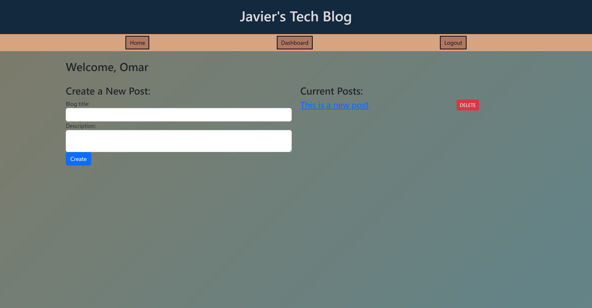

# Tech-Blog-Model-View-Controller


## Description
This project is part of a bootcamp challenge No. 14th. Is about a tech blog, a complete web application that allows users to create, read, and delete blog posts. Users can also comment on posts, providing a platform for community discussion and engagement. The application follows the MVC (Model-View-Controller) design pattern and uses Sequelize as the ORM for the MySQL database.

## Table of Content
  * [Description](#description)
  * [Technologies](#Technologies)
  * [Installation](#installation)
  * [Usage](#usage)
  * [License](#license)
  * [Resources](#Resources)
  * [Deployment](#deployment)
  * [Questions](#questions)

## Technologies

* Handlebars.js
* Node.js
* Express.js
* MySQL
* Sequelize ORM
* bcrypt
* Session-based authentication

## Installation
 Install all the packages and dependencies with the command "npm install" in the CLI.
 Renamed the .env file with the environmental variables
 ```
 DB_NAME=''
DB_USER=''
DB_PASSWORD=''
SESSION_SECRET='' "This one can be renamed and is for the server sequilize store".
```

## License
[](https://opensource.org/license/mit/)

## Resources
* https://www.npmjs.com/package/bcrypt
* https://www.npmjs.com/package/connect-session-sequelize
* https://www.npmjs.com/package/dotenv
* https://www.npmjs.com/package/express
* https://www.npmjs.com/package/express-handlebars
* https://www.npmjs.com/package/express-session
* https://www.npmjs.com/package/mysql2
* https://sequelize.org/docs/v6/getting-started/
* https://www.npmjs.com/package/nodemon

## Deployment
